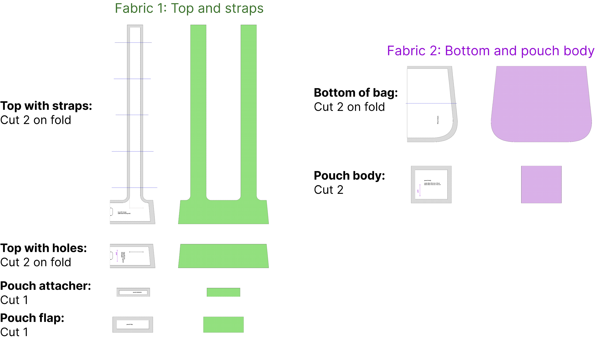

---
title: Minimal fold-up backpack
summary: Sewing pattern and assembly notes
authors:
- admin
tags: 
- Sewing
categories: []
date: "2024-01-12T00:00:00Z"
featured: false
draft: false 
math: true

links:
url_pdf: post/foldaway-backpack/letter_paper_pattern_pieces.pdf
url_code: ''
url_dataset: ''
url_poster: ''
url_project: ''
url_slides: ''
url_source: https://www.notabag.com/
url_video: ''

# Featured image
# To use, add an image named `featured.jpg/png` to your page's folder. 
image:
  caption: ''
  focal_point: ""
  preview_only: true

# Projects (optional).
#   Associate this post with one or more of your projects.
#   Simply enter your project's folder or file name without extension.
#   E.g. `projects = ["internal-project"]` references 
#   `content/project/deep-learning/index.md`.
#   Otherwise, set `projects = []`.
projects: []
---

Last summer, I purchased a product from [notabag](https://www.notabag.com/) to give as a gift. It's a great design, with the convenience of having a spare bag that can fold away into a pocket, but also the comfort to wear it as a backpack so that hands can be free and the contents don't weigh heavily on only one shoulder.

With that in mind, here is my own version of the foldable backpack with letter format printable pattern and assembly notes for my approach to sewing it. The sewing instructions here should leave no raw edges for a clean finish. I have been able to carry up to 2-3 kg in it without issue.

*My homemade bag in action.*

## Cutting out pattern pieces
The pdf linked at the top of the page should be ready to print on letter size paper. It is not the conventional printable format of assemble pages first, then cut. Instead, cut out the pieces and match up blue lines to match the cutting inventory below.

Using two contrast fabrics is optional. I chose to cut:

| Piece | Fabric | How many |
| ----- | ------ | -------- |
| Top with straps | Solid | 2 on fold |
| Top with holes | solid | 2 on fold |
| Pouch flap | Solid | 1 |
| Pouch attacher | Solid | 1 |
| Bottom of bag | Print | 2 on fold |
| Pouch body | Print | 2 |
| Scraps for sewing welt openings and pouch loop | Solid | 5 pieces a few inches in size |

## Assemble pouch
1. Sew rolled hems on 
    * a. both short sides of pouch attacher;
    * b. one long side of pouch flap;
    * c. one long side of one pouch body.
    * Seam allowance: ~12 mm / ½” total (fold over twice 6 mm / ¼”)
  

2. First outline for french seam:
    * a. Place unsewn pouch body right side down.
    * b. Place sewn pouch body on top, wrong side down, with raw edges aligned. 
    * c. Place pouch attacher in middle of top edge, right side down.
    * d. Place pouch flap aligned with top edge wrong side down, sandwiching the pouch attacher in between.
    * e. Sew around the edge at ~6 mm / ¼”.
    * f. Reinforce top seam that holds the flap and pouch attacher in place.

3. OPTIONAL: Attach loop to seam allowance on one of the short sides. Keep loop ends within seam allowance and stitch back and forth to secure them.

4. Clip corners and trim seam allowance down to a bit under 6 mm, especially if there are fraying areas.

5. Flip inside out, press corners and seams out. 
Pull pouch attacher out of the way and re-sew around the pouch just past ~6 mm / ¼” seam allowance, just far enough from the edge that the previous seam allowance enclosed inside is not caught in the stitches.
Be careful not to catch the rolled hem of the pouch body as you sew the side with the pouch attacher.

7. Flip body right side out. Set pouch aside.

## Assemble strap side of bag

1. Lay both top strap pieces right sides together with bottom piece sandwiched in between. 
Sew along straight edge with 12 mm / ½” seam allowance.

3. Burrito method to finish top edge.
    * a. Roll bag bottom tightly up into the seam sewn in step 1.
    * b. Roll up pouch and pin pouch attacher strip in between straps so that pouch is also in the “burrito”. Pouch body with right sides out should have an opening facing the same direction as the right side of the bag bottom fabric. (It isn’t a big deal if it goes the other way.)
    * c. Sew along strap edges with 12 mm / ½” seam allowance.
    * d. Clip curves.

3. Turn right side out and top stitch along seams completed in 1 and 2. Hold the pouch out of the way.
Top stitching should be about 3 mm / ⅛” away from seam.

## Assemble hole side of bag

1. Lay both top hole pieces right sides together with bottom piece sandwiched in between. 
Sew along straight edge with 12 mm / ½” seam allowance.

2. Transfer slit end points to both top pieces from pattern markings (if you haven’t already) and make sure it’s visible on the wrong side of the fabric. I like to use thread marking at either end, shown with little x markings in the instructions for one of the 4 slits to mark.

3. For each of the slits, cut a piece of scrap fabric ~ 2 cm bigger than the slit size to use as a facing.
    * a. Pin it right sides together over where the slit will be.
    * b. Sew a narrow rectangle from the wrong side, using the markings from step 2. The short side length should be about 3 mm / ⅛”. (This isn’t marked on the pattern.)
Note: I made the shorter side different inside vs. outside the bag so that when they align there is a framing effect, about 3 mm on the outer piece vs. 6 mm on the inside.
    * c. Cut inside the rectangle, getting as close to the corners as  you can.
    * d. Flip the facing through the slit and smooth it to lay cleanly on the wrong side.
    * e. Top stitch around the slit to secure it.

4. Repeat step 3 for each of the 4 slits

5. Burrito method to finish top edge. Roll bottom section inside then pin the two top sections together. Stitch with 12 mm seam allowance. Flip right side out.

6. Top stitch the adjacent slits together, going over the previous top stitched slit outline to attach the layers together and reinforce the slits.
Note: If using mismatched slit dimensions mentioned in 3b, ensure that the outer slit nicely frames the inner one before pinning.

7. Top stitch upper and lower edges of slit section.

## Finish assembly

1. Place two bag halves right sides up, feeding the straps through the slits and aligning them roughly parallel to the bag sides. Make sure nothing is twisted. Now is a good time to check the strap length and angle by pinning or basting to sides and trying it on. In my experience, it will sit much better when the bag is not empty, but at least it should be possible to check how far it falls down your back.

2. Sew the strap ends to the bottom of the bag on the slit side. I have been measuring up about 6" from the bottom and stitching a pentagon shape as shown. This is not marked on the pattern because you may have different preferences for where the straps are anchored.

3. Assemble the halves with an inside out french seam. First, with the two bag halves right sides together, sew around the outside "U" shape with 12 mm / ½” seam allowance.

4. Flip bag right way out and clip seam allowance if necessary to fully push out and flatten the seam sewn in step 3. Sew around the "U" shape again with slightly larger seam allowance, enclosing the seam allowance on the inside. The reason I prefer to do this "inside out" french seam is to encourage the bag to stay flat for folding into the pouch, and to keep the inside of the bag neat without seam allowances.

## All done!
To tuck the bag away into the pouch, I fold down the straps, fold the bag in 3 from side to side and then in 4 from top to bottom.

The pattern for the pouch may be too big or small depending on the weight of the fabric used.
